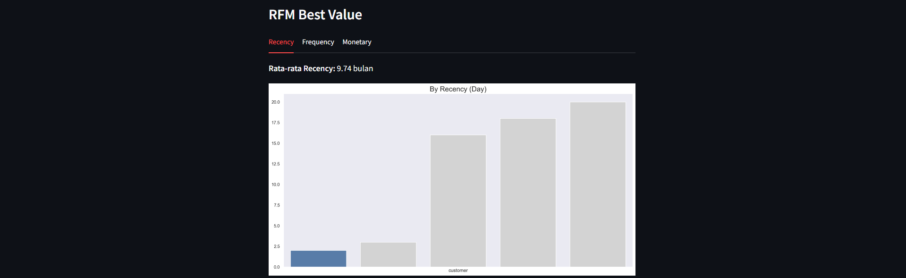

# bangkit-dicoding
**Course: Belajar Analisis Data dengan Python**

## Dataset

Dataset yang digunakan berasal dari: [Kaggle](https://www.kaggle.com/datasets/olistbr/brazilian-ecommerce/data)

## Deskripsi

Proyek ini bertujuan untuk menganalisis data pada E-Commerce Public Dataset. Analisis data dilakukan pada Google Collab yang kemudian divisualisasikan dalam dashboard interaktif yang dibuat dengan menggunakan Streamlit.

## Struktur Direktori

- **/data**: Direktori ini berisi data yang digunakan dalam proyek, dalam format .csv dan ada 1 file yang disimpan dalam format .zip (berisi 1 file .csv) untuk compress ukuran file.
- **/dashboard**: Direktori ini berisi dashboard.py yang digunakan untuk membuat dashboard hasil analisis data.
- **Notebook_Proyek_Analisis_Data.ipynb**: Direktori ini digunakan untuk melakukan analisis data.

## Instalasi

1. Clone repository atau download repository ke local

   ```shell
   git clone https://github.com/FithrotuzZ/bangkit-dicoding.git
   ```

2. Set up environment untuk Python dan Anaconda:

   ```shell
   conda create --name myenv python=3.9
   conda activate myenv
   pip install -r requirements.txt
   ```

## Google Collab
Hanya perlu menjalankan setiap chunks yang ada di link bawah ini:

Dokumentasi: [Google Collab](https://colab.research.google.com/drive/1885D68323nwe5Rn3eQlP8fVeP7RafC2B?usp=sharing)

## Streamlit
### Run di local
Setelah mengaktifkan environment virtual anaconda dengan nama myenv, arahkan ke path folder **dashboard** yang berisi 3 file untuk menjalankan command untuk menjalankan dashboard:

   ```shell
   streamlit run dashboard.py
   ```
Kemudian akan diarahkan menuju localhost streamlit yang menampilkan dahsboard yang dibuat. Sesuaikan dashboard.py sesuai dengan intruksi (comment) yang diberikan

### Run setelah deploy
Aplikasi streamlit versi deploy dapat diakses di [Streamlit](https://bangkit-dicoding.streamlit.app/)
Note: Download file all_data.csv, kemudian upload ke streamlit

Dokumentasi: 
</img>
</img>
</img>
</img>
</img>
</img>
</img>
</img>
